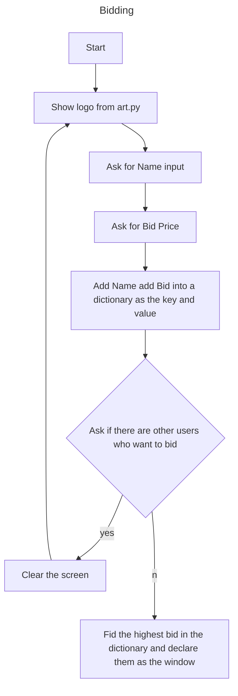

```mermaid
---
title: Bidding
---
flowchart TD
    A[Start] --> B[Show logo from art.py]
    B --> C[Ask for Name input]
    C --> D[Ask for Bid Price]
    D --> E[Add Name add Bid into a dictionary as the key and value]
    E --> F{Ask if there are other users who want to bid}
    F --yes--> G[Clear the screen]
    G --> B
    F --no-->H[Fid the highest bid in the dictionary and declare them as the window]
```
